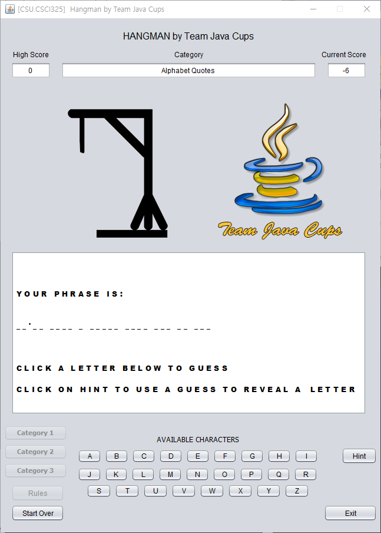

[Back to Portfolio](./)

Project HangMan Game
===============

-   **Class: CSCI 325 - Object-Oriented Programming** 
-   **Grade: A** 
-   **Language(s): Java** 
-   **Source Code Repository:** [tomato1904/csci-325-Fall20-Team-Java-Cups](https://github.com/tomato1904/csci-325-Fall20-Team-Java-Cups)  
    (Please [email me](mailto:jmin@csustudent.net?subject=GitHub%20Access) to request access.)

## Project description

This project is covering object-oriented programming class using Java. Course includes application and applet development, control structures, classes methods, arrays, inheritance, polymorphism, strings and characters, graphics, graphical user interface components, stacks, queues, trees, recursion and exception handling. Based on all the knowlege I learned from Java, Hangman Game is created as a team project.

## JAVA Software 

If you need help finding a software to run the code, [click here](https://www.guru99.com/install-eclipse-java.html) to get help setting up the JAVA environment.

## How to compile and run the program

Import the file from [here](https://github.com/tomato1904/csci-325-Fall20-Team-Java-Cups) using a JAVA IDE software (etc. Eclipse, Atom, Visual Studio, Net Beans). By clicking "Run" button, you can simply run the application.

If the programming language does not require compilation, make sure jdk is installed within the proper setting in order to debug java.

## UI Design

The project is in 100% Java language. Instead of JFrame, Swing is used for graphical user interface(GUI). User will interact by clicking the button on the bottom of the screen. Calculated scores appear at the other end on the top of the screen. Selected category is in between score screen. User will be notified everytime she/he miss or get the answer.

When all the files compile successfully, (see Fig 1), the game, HangMan launches as it shown below. When a player clicks rule, the rule appears (see Fig 2). When a player clicks the start button, a game starts (see Fig 3).

  
Fig 1. The Launch Screen

  
Fig 2. The Rule Screen

  
Fig 3. The Start Screen When a Game Starts

## 3. Additional Description.

A player can choose a category and the it will appear in the category box at the top of the game screen (see Fig 4). When the input is registered, output will shown in the white game screen (see Fig 5). If a player max out his/her chances, game is over (see Fig 6). If a play guess all the alphabets within given opportunities, victory screen appears as it shown (see Fig 7).

  
Fig 4. The Category Screen.

  
Fig 5. The Play Screen.

  
Fig 6. Game Over.

  
Fig 7. Player Win.

For more details see [GitHub Flavored Markdown](https://guides.github.com/features/mastering-markdown/).

[Back to Portfolio](./)
